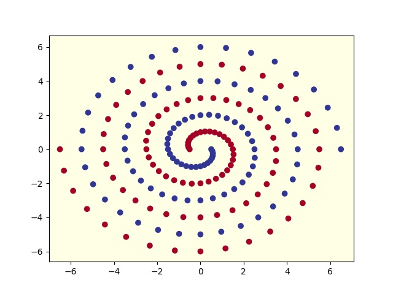
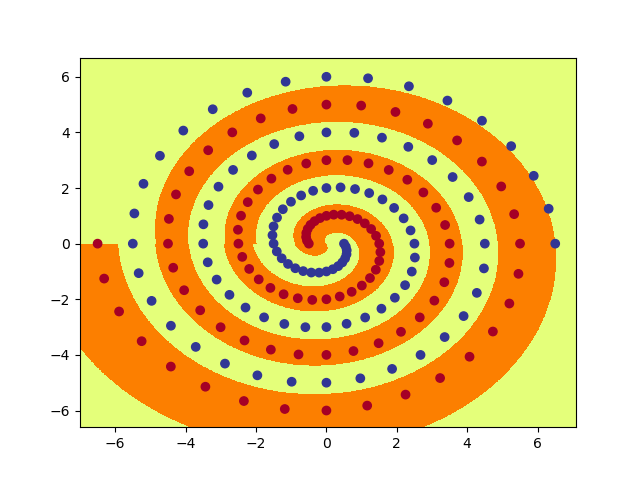
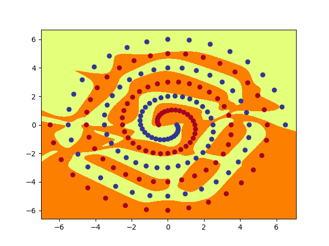

# Spirals

## Introduction

We are interested in training on the famous Two Spirals Problem (Lang and Witbrock, 1988).

The earliest neural networks (_perceptrons_) could only act as linear classifiers, which means that the networks could only separate data points by a straight line, plane, or hyperplane.

Later, neural networks with hidden layers could draw more complicated decision boundaries, and solved the famous XOR problem that had been originally posed by Minsky & Papert. However even then, early neural networks, with simple densely connected linear models, were unable to classify apart data points that lay along two interleaved spirals, as depicted in the image below.



spiral_main.py loads the training data from spirals.csv, applies two different specified model and produces a graph of the resulting function, along with the data.

### PolarNet

`PolarNet` operates as follows: First, the input (x,y) is converted to polar co-ordinates (r,a) with r=sqrt(x\*x + y\*y), a=atan2(y,x). Next, (r,a) is fed into a fully connected neural network with one hidden layer using tanh activation, followed by a single output using sigmoid activation. In other words, it transforms the domain from rectangular to polar coordinates.

Run the code by typing
```
python3 spiral_main.py --net polar --hid 7
```

We finally set the number of hidden nodes to 7 so that `PolarNet` learns to correctly classify all of the training data within 20000 epochs, on almost all runs. The graph_output() method generates a picture of the function computed by `PolarNet`:



### RawNet

`RawNet` operates on the raw input (x,y) without converting to polar coordinates. It consists of two fully connected hidden layers with tanh activation, plus the output layer, with sigmoid activation. The two hidden layers each has the same number of hidden nodes, determined by the parameter num_hid.

Run the code by typing
```
python3 spiral_main.py --net raw
```

We finally set the number of hidden nodes (--hid) as 10 and the size of the initial weights (--init) as 0.2 so that this `RawNet` learns to correctly classify all of the training data within 20000 epochs, on almost all runs. The graph_output() method generates a picture of the function computed by `RawNet`:



We can see that even without domain transformation, a complex-enough network can solve the problem to an arbitrary degree of accuracy, even if the resulting classification boundary and objective function might not be elegant to the human eye. 